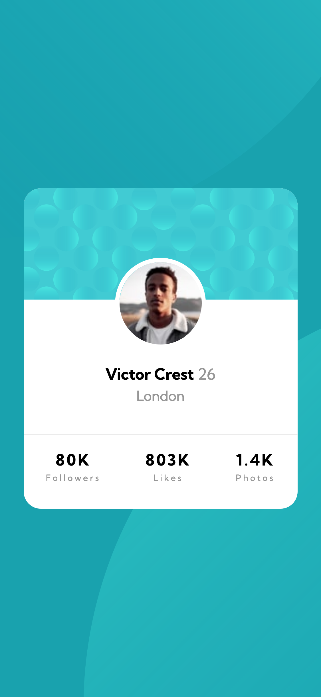
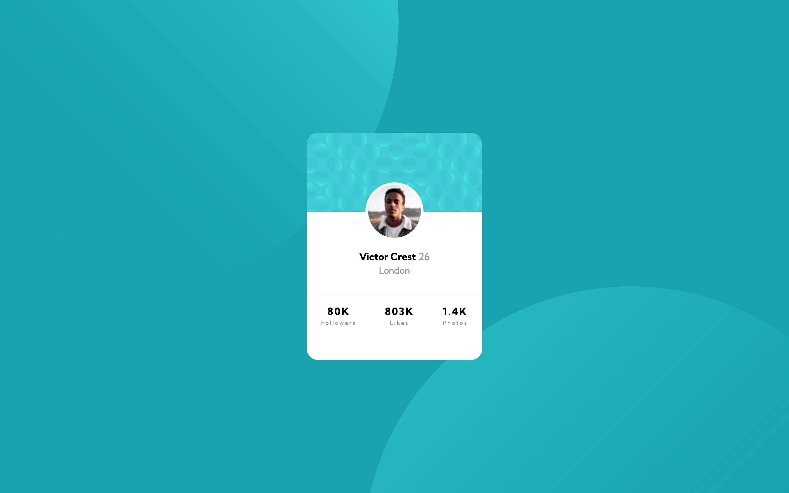

# Frontend Mentor - Profile card component solution

This is a solution to the [Profile card component challenge on Frontend Mentor](https://www.frontendmentor.io/challenges/profile-card-component-cfArpWshJ).

## Table of contents

- [Frontend Mentor - Profile card component solution](#frontend-mentor---profile-card-component-solution)
  - [Table of contents](#table-of-contents)
  - [Overview](#overview)
    - [The challenge](#the-challenge)
    - [Screenshot](#screenshot)
    - [Links](#links)
    - [Built with](#built-with)
  - [Author](#author)

**Note: Delete this note and update the table of contents based on what sections you keep.**

## Overview

### The challenge

- Build out the project to the designs provided

### Screenshot

| Mobile                                                                                | Desktop                                                                                 |
| ------------------------------------------------------------------------------------- | --------------------------------------------------------------------------------------- |
|  |  |

### Links

- Live Site URL: [https://rauf-dev.github.io/fm_profile-card-component/](https://rauf-dev.github.io/fm_profile-card-component/)

### Built with

- Semantic HTML5 markup
- CSS custom properties
- Flexbox
- Mobile-first workflow

## Author

- Website - [raUF!](https://www.heyrauf.com)
- Frontend Mentor - [@raUF!](https://www.frontendmentor.io/profile/yourusername)
